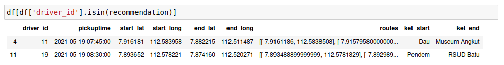
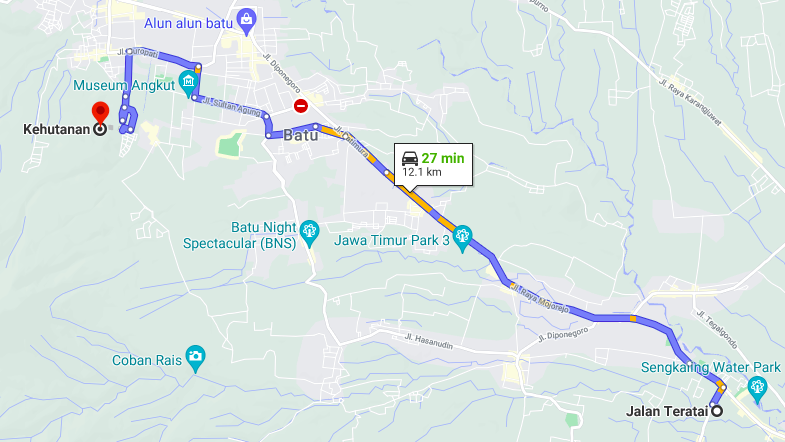
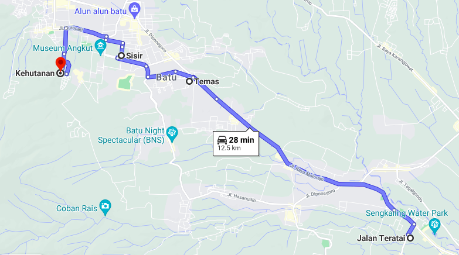

<!--
*** Thanks for checking out the Best-README-Template. If you have a suggestion
*** that would make this better, please fork the repo and create a pull request
*** or simply open an issue with the tag "enhancement".
*** Thanks again! Now go create something AMAZING! :D
***
***
***
*** To avoid retyping too much info. Do a search and replace for the following:
*** github_username, repo_name, twitter_handle, email, project_title, project_description
-->

<!-- PROJECT SHIELDS -->
<!--
*** I'm using markdown "reference style" links for readability.
*** Reference links are enclosed in brackets [ ] instead of parentheses ( ).
*** See the bottom of this document for the declaration of the reference variables
*** for contributors-url, forks-url, etc. This is an optional, concise syntax you may use.
*** https://www.markdownguide.org/basic-syntax/#reference-style-links
-->

[![Contributors][contributors-shield]][contributors-url]
[![Forks][forks-shield]][forks-url]
[![Issues][issues-shield]][issues-url]
[![MIT License][license-shield]][license-url]

<!-- PROJECT LOGO -->
<br />
<p align="center">
  <a href="#">
    
  </a>

  <p align="center">
    
    
  </p>

  <h3 align="center">Kotlite (Angkot Elite) Matching Algorithm</h3>

  <p align="center">
    A Part of Kotlite Ridesharing Application
    <br />
    <a href="#"><strong>Explore the Projects »</strong></a>
    <br />
    <br />
    <!-- <a href="https://github.com/github_username/repo_name">Download Apk</a>
    · -->
    <a href="https://github.com/kroniz-utab/kotlite_algorithm/issues">Report Bug</a>
    ·
    <a href="https://github.com/kroniz-utab/kotlite_algorithm/issues">Request Feature</a>
  </p>
</p>

<!-- TABLE OF CONTENTS -->
<details open="open">
  <summary><h2 style="display: inline-block">Table of Contents</h2></summary>
  <ol>
    <li>
      <a href="#about-the-project">About The Project</a>
      <ul>
        <li><a href="#built-with">Built With</a></li>
      </ul>
    </li>
    <li>
      <a href="#getting-started">Getting Started</a>
      <ul>
        <li><a href="#prerequisites">Prerequisites</a></li>
        <li><a href="#installation">Installation</a></li>
      </ul>
    </li>
    <li><a href="#dataset">Dataset</a></li>
    <li><a href="#source">Source</a></li>
    <li>
      <a href="#dataset">Algorithm Explanation</a>
      <ul>
        <li><a href="#location-based-filtering">Location-based Filtering</a></li>
        <li><a href="#similar-direction-approach">Similar Direction Approach</a></li>
        <li><a href="#pickup-time-filtering">Pickup Time Filtering</a></li>
        <li><a href="#distance-based-filtering">Distance-based Filtering</a></li>
      </ul>    
    </li>
    <li><a href="#result-of-testing">Result of Testing</a></li>
    <li><a href="#contributing">Contributing</a></li>
    <li><a href="#license">License</a></li>
    <li><a href="#contact">Contact</a></li>
    <li><a href="#acknowledgements">Acknowledgements</a></li>
  </ol>
</details>

<!-- ABOUT THE PROJECT -->

## About The Project

Kotlite is here as a breakthrough idea that answers the need of users to find drivers or passengers from and going to the same routes. It is designed to optimistically accelerate the transformation of the citizens' lifestyle to rideshare and network, eliminating incurable rush hour traffic and provide practicality for user's mobility from one place to another.

<!-- ini bagian teknisnya -->

We use the Machine Learning approach to provide passenger, driver recommendations who have the same route. By using the recommendation system that we created, the system will offer passengers with recommendations for drivers who will travel past the passenger pickup location and through or to the passenger dropoff location. In this recommendation system, we use a location-based filtering approach, similar direction approaching, pickup time filtering, and distance-based filtering.

### Built With

- [Tensorflow](https://www.tensorflow.org/)
- [Pandas](https://pandas.pydata.org/)
- [Google Colab](https://colab.research.google.com/) or [Jupyter Notebook](https://jupyter.org/)
- [Google Maps Services Python](https://github.com/googlemaps/google-maps-services-python)

<!-- GETTING STARTED -->

## Getting Started

To get a local copy up and running follow these simple steps.

### Prerequisites

This project requires several resources to be prepared and installed on the local computer, including:

- [Python Virtual Environtment](https://www.python.org/downloads/) (recommendation)
- [Python ver 3.6.x - 3.8.x](https://www.python.org/downloads/) (we use python version 3.8.5)
- [Google Maps API Key](https://developers.google.com/maps)

### Installation

1. Clone the repository

   ```sh
   $ git clone https://github.com/kroniz-utab/kotlite_algorithm.git

   # cd to the repository folder
   $ cd kotlite_algorithm
   ```

2. Install the required environment with virtualenv **(recommendation)**. This part is for a run on local computer

   - Linux/macOs
     ```sh
     $ virtualenv env
     $ source env/bin/activate
     (venv) $ pip install -r requirements.txt
     ```
   - Windows
     ```sh
     python -m venv env
     env\scripts\activate
     pip install -r requirements.txt
     ```

3. For the local computer, you can run this project using jupyter notebook by this way in your CLI

   ```sh
   $ jupyter notebook
   ```

4. Setup `Maps API`, if you found `API KEY` on the notebook, change it by your Google Maps API Key.

5. And you can explore how our algorithm was built.

<!-- USAGE EXAMPLES -->

## Dataset

- [NYC Trip Distance Matrix](https://www.kaggle.com/debanjanpaul/new-york-city-taxi-trip-distance-matrix)
- [KWB Dummy Taxi Dataset](https://raw.githubusercontent.com/kroniz-utab/kotlite_algorithm/master/datasets/kotlite_driver_dataset_KWB_with_ket.csv)

  We use the KWB Dummy Taxi dataset to test the algorithm we use. We created this dataset because we feel that the data in the NYC Trip Distance matrix dataset is still insufficient to support our system. so we create our dataset to get the data we want.


## Source

- [Ridesharing Matching Algorithm](https://www.sciencedirect.com/science/article/pii/S2352146516308730)
- [Lyft Matchmaking](https://eng.lyft.com/matchmaking-in-lyft-line-9c2635fe62c4#.tac6tkgo7)
- [link jurnal 3]()

## Algorithm Explanation

Our recommendation system works using variations of approaches to get the best recommendation results based on our opinion. The purpose of this recommendation system is to find drivers that most closely match destinations, directions, and routes. Our recommendation system is based on the Nearest Neighbor Algorithm. The reason we use the nearest neighbor algorithm is that we gather real-time data or to be called crowdsourcing. In that case, we need to do continuous training when passengers want driver recommendations. Our recommendation system does not only rely on the nearest neighbor algorithm, but we also take several approaches so that passengers get good driver recommendations, and drivers do not have to travel too far to pick up or drop off passengers.

### Location-based Filtering

Location-based Filtering is the main approach of what we use. This approach uses the Nearest Neighbor Algorithm to detect the closest route point from all driver trip data to the pickup and drop-off points of passengers. This closest point will be used for other approaches.

### Similar Direction Approach

Similar Direction Approach is the approach we use to determine whether drivers have the same direction of travel. We use the driver sequence route data to see if the drivers are in a similar direction or not.

### Pickup Time Filtering

Pickup Time Filtering is the approach we use to provide driver recommendations to passengers based on the passenger's desired pickup time. To get the best recommendation, we use pickup time filtering as one of the approaches in our recommendation system.

### Distance-based Filtering

Distance-based Filtering is the process we use to make our drivers feel free. It is practical to find the distance value from the driver's closest location point to the passenger's pickup and dropoff point. We use this approach to limit the range of distances a driver must travel to pick up and drop off passengers on the main route the driver must take.

## Result of Testing

We test the algorithm that we have built using the dataset [KWB Dummy Taxi Dataset](https://raw.githubusercontent.com/kroniz-utab/kotlite_algorithm/master/datasets/kotlite_driver_dataset_KWB_with_ket.csv) using the data
passengers who want to depart from MAN 1 Kota Batu on `(-7.8838611,112.5381295)` to GOR Gajah Mada Kota Batu on `(-7.8786821,112.524145)`.




By using a threshold of 0.7 km from the nearest point, the system recommends 2 drivers who have a similar route, namely the driver with id `[11,19]`. We're trying to see how effective the system is at providing driver recommendations to passengers. In this case, we want to test using google maps to see and assess how effective this system is. The testing process uses a scenario that the driver will pick up passengers and then deliver them first before the driver goes to his final destination.



<p align="center">Image of the main route the driver should have taken with ID 11</p>



<p align="center">Image of the route of the driver who has to pick up and drop off passengers</p>

However, if the driver with ID 11 picks up passengers and delivers them to the passenger's destination, the distance covered will be 12.5 km with an estimated travel time of 28 minutes. It is nice that the system can search for and recommend drivers who have the same direction to passengers. The results of the recommendations are also not burdensome or detrimental to drivers because the maximum pick-up distance is limited to 0.7 km from the point provided by the maps.

<!-- CONTRIBUTING -->

## Contributing

Feel free to clone, use, and contribute back via [pull request](https://docs.github.com/en/github/collaborating-with-pull-requests/proposing-changes-to-your-work-with-pull-requests/about-pull-requests). We'd love to see your pull requests and send them in! Please use the [issues tracker](https://github.com/kroniz-utab/kotlite_algorithm/issues) to raise bug reports and feature requests.

We are excited to see the amazing features you build in your application using this project. Do ping us at our [contact](#contact) once you build one, feel free to contact us, and we would love to feature your app on our blog.

<!-- LICENSE -->

## License

Distributed under the MIT License. See `LICENSE.md` for more information.

<!-- CONTACT -->

## Contact

How can we help you? While we're occupied for the Capstone Project, there are simpler ways for us to get in touch! Please do visit us at

<!-- ACKNOWLEDGEMENTS -->

## Acknowledgements

<p align="center">
  </img>&nbsp; &nbsp;
</p>

<!-- MARKDOWN LINKS & IMAGES -->
<!-- https://www.markdownguide.org/basic-syntax/#reference-style-links -->

[contributors-shield]: https://img.shields.io/github/contributors/kroniz-utab/kotlite_algorithm.svg?style=flat
[contributors-url]: https://github.com/kroniz-utab/kotlite_algorithm/graphs/contributors
[forks-shield]: https://img.shields.io/github/forks/kroniz-utab/kotlite_algorithm.svg?style=flat
[forks-url]: https://github.com/kroniz-utab/kotlite_algorithm/network/members
[issues-shield]: https://img.shields.io/github/issues/kroniz-utab/kotlite_algorithm.svg?style=flat
[issues-url]: https://github.com/kroniz-utab/kotlite_algorithm/issues
[license-shield]: https://img.shields.io/github/license/kroniz-utab/kotlite_algorithm.svg?style=flat
[license-url]: https://github.com/kroniz-utab/kotlite_algorithm/blob/master/LICENSE.txt

<!-- https://github.com/SVeeIS/kotliteProjectAPI -->
